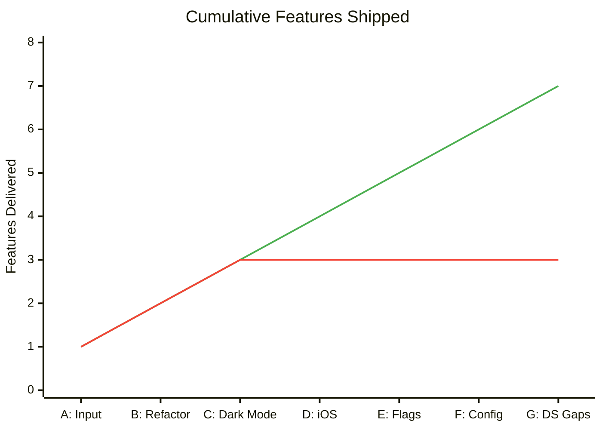

# What We Learned: Functional vs Imperative DX on MetaMask's Design System

**What happens when you try to build cross-platform apps on top of MetaMask's design system?**

We ran a structured experiment: seven progressively harder tasks, implemented on both a functional/monadic branch and an imperative branch, all using the same MetaMask Design System (MDS) packages. The goal was to find out which approach works better for building apps on top of an enterprise design system.

The short version? Imperative is faster out of the gate, but functional pays off in ways that really matter: cross-platform support, testability, design system compliance, and not wanting to throw your laptop out the window when you need to add feature flags.

**The headline finding:** The functional approach needed about 2.6x more code upfront. But it was the *only* approach that could ship iOS support without a major rewrite. The imperative branch produced a document explaining why it couldn't; the functional branch produced a working app.

> For the detailed per-task implementation notes, code samples, and architecture deep-dives, see the companion [Evidence Journal](./mm-dx-research.md).

---

## Our Thesis

> Functional composition patterns create architectural leverage that aligns with how you actually want to test things: fast tests, tests that predict production behavior, tests that don't cost a fortune to maintain, and tests that help you ship faster instead of slowing you down.

That's a mouthful. Let's break it down through the numbers, the velocity data, and six key insights from seven tasks.

---

## The Numbers

### By the Numbers

| Metric | Functional | Imperative | Ratio |
|--------|------------|------------|-------|
| Total lines of code (Tasks A-D) | 864 | 327 | 2.6x |
| Reusable primitives created | 7 | 1 | 7x |
| Platforms supported | 2 (Web, iOS) | 1 (Web) | 2x |
| Files with platform conditionals | 0 | N/A | — |
| Files changed for design directive (Task G) | 15 (3 logic, 12 mechanical) | N/A (no centralized layer) | — |

### Cost Per Task (Functional)

This tells the compounding story. The infrastructure gets built once; each subsequent feature pays less for cross-platform support.

| Task | New Lines | Shared | Web-Only | Native-Only | Modified Files | New Deps |
|------|-----------|--------|----------|-------------|----------------|----------|
| A: Input Component | 147 | 147 | 0 | 0 | 1 | 0 |
| B: AddressSelect Refactor | 65 | 65 | 0 | 0 | 1 | 0 |
| C: Dark Mode | 85 | 85 | 0 | 0 | 2 | 0 |
| D: Cross-Platform (iOS) | 567 | 45 | 287 | 235 | 3 | 5 |
| E: Feature Flags | 318 | 70 | 108 | 175 | 4 | 0 |
| F: UI Config System | 849 | 215 | 351 | 283 | 6 | 1 |
| G: Close Adapter Gaps | 140 | 55 | 60 | 45 | 15 | 0 |

A few things stand out:

**Shared code is the minority.** Tasks D, E, and F all have more platform-specific code than shared code. That's not a failure of the architecture; it's the architecture doing its job. The shared code (types, context, hooks) defines the *contract*. The platform-specific code implements the *interaction*. A long-press on iOS feels different from a long-press on web, and the code reflects that.

**Marginal cost is shrinking.** Task D established the `.native.tsx` pattern and adapter layer (567 lines of infrastructure). Task E reused that pattern (318 lines). Task F reused it again (849 lines, but that includes a full dialog with 5 property editor types). The infrastructure cost per feature is trending toward zero; what's left is feature complexity.

**Design directives propagate, not percolate.** Task G is the proof. The design team says "stop using `style` escape hatches for layout properties." In the functional model, that means expanding `BoxProps` in one file, updating two adapter implementations, and then every consumer change is a mechanical substitution. 140 new lines of logic, 15 files touched, zero behavioral changes. In an imperative codebase without a centralized adapter layer, that directive has no single place to land.

### Capabilities Comparison

| Capability | Functional | Imperative |
|------------|------------|------------|
| Cross-platform support | Working iOS app | Would need a rewrite |
| Feature flag system | Context-based, easy to test | Would need to retrofit |
| Environment abstraction | Define once, works everywhere | Checks scattered all over |
| Service swapping | Dependency injection | Direct imports |
| Unit testability | Pure functions, isolated | Coupled to React lifecycle |
| Design system compliance | Expand adapter types, consumers update mechanically | Code review comments that drift |

> For per-task breakdowns, code samples, and the full architecture comparison, see the [Evidence Journal](./mm-dx-research.md#the-details).

---

## The Velocity Crossover

Here's the thing nobody tells you about "move fast" architectures. We can measure this in commits, not calendar time, because both branches worked through the same task sequence:



> **Green:** Functional (keeps shipping; infrastructure compounds with each feature)
>
> **Red:** Imperative (stalled at feature 4; requesting budget to retrofit architecture)

The Y-axis is cumulative features shipped: the thing PMs and EMs actually track. Both branches worked through the same backlog. The imperative line doesn't crash; it flatlines. That's arguably worse than a cliff: a cliff implies something broke, a flatline implies the approach simply ran out of runway.

```
                Task A    Task B    Task C    Task D    Task E    Task F    Task G
Functional:     Input     Dropdown  DarkMode  iOS ✅    Flags ✅   Config ✅  DS Gaps ✅
Imperative:     Input     Refactor  DarkMode  iOS ❌    —         —         —
```

The crossover happens at the 4th feature commit. Tasks A through C, both branches deliver (imperative faster). At Task D (cross-platform), imperative produces a document explaining why it can't; functional produces a working iOS app. Tasks E, F, and G don't exist on the imperative branch at all.

After the crossover, functional patterns compound while imperative patterns accumulate debt. Each new feature on the functional branch reuses infrastructure that's already paid for (adapters, contexts, `.native.tsx` resolution). Each new feature on the imperative branch would require retrofitting that infrastructure first.

---

## Key Insights

### 1. Cross-platform comes free or requires a rewrite

Task D is where the imperative approach hit a wall. The functional branch delivered a working iOS app; the imperative branch delivered a document explaining what it would take to get there (and then didn't do it, because it would've meant starting over).

The functional architecture handles this through platform-specific file resolution: `web.tsx` and `native.tsx` implement the same adapter interface, and the bundler picks the right one. Components just call `usePrimitives()` and don't know which platform they're on. The entire cross-platform cost is in the adapter layer; everything above it is shared.

The imperative alternative? Platform conditionals scattered through every component, MDS imports that break the native bundle, and no way to tree-shake unused platform code.

> For the full Task D implementation details, see [Evidence Journal: Task D](./mm-dx-research.md#task-d-cross-platform-ios).

### 2. Architecture only works if you use it

Task F's most interesting finding wasn't the feature itself (a runtime UI config dialog); it was the failure mode. The initial implementation bypassed the adapter layer, using raw HTML (`<div>`, `<input type="range">`, `<button>`) instead of going through `usePrimitives()`. Web worked great. Native crashed immediately.

**A good architecture can still produce a bad outcome if you don't use it.** The adapter layer was right there. The patterns were established. The developer (in this case, an AI) just went around them, because raw HTML was faster to type.

There was a structural reason for the bypass: the adapter didn't cover modals, range inputs, or color pickers. When the primitives don't cover what you need, the path of least resistance is to drop down to the platform directly, which silently breaks cross-platform support. The fix was platform-specific files (`ConfigDialog.tsx` and `ConfigDialog.native.tsx`), following the same pattern established in Tasks D and E.

The lesson: the adapter layer should have a clear policy for when it's OK to go platform-specific, and the `.native.tsx` mechanism should be the obvious choice, not an afterthought.

> For the three bypass points, the fix for each, and the Metro cache gotcha, see [Evidence Journal: Task F](./mm-dx-research.md#task-f-ui-config-system-long-press-configuration-dialog).

### 3. Adapter surface width determines guideline enforceability

Task G revealed something subtle: even when AI guidelines exist and the AI follows them perfectly, the adapter surface determines the boundary between "correct" and "escape hatch."

Before Task G, `BoxProps` didn't have props for `position`, `flex`, `overflow`, or `opacity`. An AI following `agents.md` to the letter would still produce `style={{ position: 'relative' }}` because the adapter didn't offer a semantic alternative. The guidelines said "no inline styles," but the architecture couldn't support that rule. That's not a documentation problem; it's an architecture problem.

After expanding `BoxProps` to cover common layout properties, ~95% of layout is expressible via adapter props. The remaining `style` usages are genuinely platform-specific (shadows, transforms, animations) and are documented as acceptable escape hatches.

The effort split tells the story: **3 files needed new logic** (types.ts, web.tsx, native.tsx), **12 files needed only mechanical substitutions** (swap `style={{ prop: value }}` for `prop={value}`). That 20/80 ratio is the adapter architecture doing exactly what it's designed to do.

> For the full audit, code examples, and remaining escape hatches, see [Evidence Journal: Task G](./mm-dx-research.md#task-g-close-adapter-gaps-design-system-compliance).

### 4. Design directives propagate structurally, not socially

This is the imperative counterfactual from Task G. In an imperative codebase, the directive "stop using inline styles for layout properties" has no single place to land. It becomes:

1. A code review comment that gets applied inconsistently across PRs
2. A lint rule that flags violations but can't auto-fix
3. A refactoring sprint that touches the same files but without the guarantee that the changes are mechanical

The functional approach turns a social directive ("please stop doing this") into a structural one ("the type system now supports this; use it"). The social version has a half-life measured in sprints. The structural version is permanent.

### 5. The documentation stack

The study revealed a three-layer documentation stack that works together:

- **`PROBLEM_STATEMENT.md`** identifies the problem: AI tools generate `<div style={{ backgroundColor: '#3b82f6' }}>` instead of design system components
- **`DESIGN_GUIDELINES/COMPONENTS.md`** documents the raw design system: what MDS components exist and how to use them
- **`agents.md`** documents the adapter layer: how this codebase wraps MDS for cross-platform use

Task G validated that all three layers are necessary. `COMPONENTS.md` tells an AI *what* to generate. `agents.md` tells it *how* this codebase implements those rules. But documentation can only enforce what the architecture supports. After Task G expanded the adapter surface, the problem statement's "Desired State" becomes structurally achievable:

| Problem Statement Goal | Before Task G | After Task G |
|------------------------|---------------|--------------|
| "AI generates code using design system" | Partial: 60% of layout needed escape hatches | ~95% expressible via adapter props |
| "Design team updates tokens, all components update" | Partial: only colors/spacing | Layout, positioning, borders also centralized |
| "Zero drift after 6 months" | Unlikely: escape hatches accumulate | Remaining escape hatches are documented, intentional |
| "New developer uses AI, gets compliant code" | Partial: guidelines unenforceable for layout | Guidelines now match adapter surface |

### 6. Testing alignment scorecard

We evaluated both approaches against four properties that characterize effective testing at scale:

| Property | What It Means |
|----------|---------------|
| **Fast** | Tests execute quickly; tight feedback loops |
| **Predictive** | Test results signal production behavior |
| **Low Cost** | Minimal time, money, cognitive overhead |
| **Velocity-Enabling** | Fail fast, document the domain |

| Property | Functional | Imperative | Enterprise Winner |
|----------|-----------|------------|-------------------|
| Fast | Strong | Degrades with scale | Functional |
| Predictive | Strong | Weak (scattered patterns) | Functional |
| Low Cost | High initial, amortized over time | Low initial, high marginal | Functional (>4 features) |
| Velocity-Enabling | Strong | Weak (no guardrails) | Functional |

**The trap:** enterprises often regret choosing imperative patterns for "faster time-to-market." They optimize for the one property (low initial cost) that doesn't matter at enterprise timescales. We saw this play out in the study: features 1-3, imperative ships faster and the team celebrates velocity. Feature 4, imperative hits a wall and produces a document instead of a working app. Features 5-7 don't exist on the imperative branch. The functional approach's "slower start" is actually buying alignment with the properties that matter at scale, and the crossover point is measurable: it's the feature where you first need something the imperative approach didn't build infrastructure for.

> For the detailed per-property breakdown tables, see [Evidence Journal: Testing Practices](./mm-dx-research.md#so-does-this-actually-align-with-good-testing-practices).

---

## When to Use Which

### When Functional Makes Sense

- Cross-platform requirements exist or are anticipated
- Team size exceeds 10 engineers
- Long-term maintainability matters
- Extensive testing is required
- Feature flagging or A/B testing is needed
- Design system team ships directives that need to propagate across a codebase

**The PMF angle:** if you're still searching for product-market fit, the functional model turns A/B testing into a composition problem. Feature flags (Task E) gate which variant renders, the adapter layer (Task D) ensures both variants work cross-platform, and the runtime config system (Task F) lets you tweak behavior without redeployment. An experiment is a different provider composition per cohort; cleanup is removing the losing variant's isolated code, not hunting scattered conditionals. Experimentation velocity matters as much as feature velocity when you're still learning which features to keep.

### When Imperative Makes Sense

- Single-platform, web-only application
- Rapid prototyping or MVP phase
- Small team (1-5 engineers)
- Short project lifespan
- Time-to-first-feature is the only thing that matters

### The Bottom Line

The functional approach's "overhead" is actually infrastructure that creates both architectural leverage and test philosophy alignment. This dual benefit explains why the 2.6x initial investment yields compounding returns:

| Capability | Functional | Imperative |
|------------|------------|------------|
| Add new platform | Add adapter file | Rewrite architecture |
| Add feature flag | Add to interface | Retrofit flag system |
| Swap service impl | Change provider | Hunt direct imports |
| Test component | Mock contexts | Mock modules |
| Absorb design directive | Expand adapter types (3 files) | Code review comments (drift) |

For projects with any of the following characteristics, we recommend the functional approach despite higher initial investment:

1. **Multi-platform ambitions**: Even "web-only for now" often evolves
2. **Team growth expectations**: Functional patterns scale better with headcount
3. **Design system integration**: Adapters isolate DS changes from components; directives propagate structurally
4. **Compliance/audit requirements**: Pure functions are easier to verify
5. **AI-assisted development**: A well-typed adapter layer constrains AI output to compliant patterns (Task G)

The 2.6x initial investment pays dividends in both architectural capabilities (cross-platform, feature flags, design system compliance) and test philosophy alignment (fast, predictive, low-cost, velocity-enabling).

I think that basically covers it!

---

## Study Design

Both approaches used the same MetaMask Design System (MDS) packages:

| Package | What It Does |
|---------|--------------|
| `@metamask/design-system-react` | The component library (Box, Text, Button, etc.) |
| `@metamask/design-system-tailwind-preset` | Tailwind theme config |
| `@metamask/design-tokens` | Design tokens for colors, typography, spacing |

| Branch | Pattern | What's In It |
|--------|---------|--------------|
| `mm-imperative_01` | Imperative | Direct MDS usage, platform logic sprinkled inline |
| `mm-monad_01` | Functional | MDS wrapped in adapters, logic abstracted out |
| `mm-monad_02` | Functional | Same, but with code review feedback for larger teams |
| `mm-monad_03` | Functional | Feature flags, environment context |

| Task | Difficulty | What We're Testing |
|------|------------|-------------------|
| A: Input Component | Low | Can we reuse validation logic? |
| B: AddressSelect Refactor | Medium | Can we extract reusable primitives? |
| C: Dark Mode | Medium | Can we separate pure logic from side effects? |
| D: Cross-Platform (iOS) | High | Does the architecture extend, or do we start over? |
| E: Feature Flags | High | Runtime config, platform-specific UI |
| F: UI Config System | High | What happens when you bypass the adapter layer? |
| G: Close Adapter Gaps | Medium | Can a design directive propagate through layers without rewrites? |

> For the detailed per-task implementation notes, provider stack evolution, code samples, and architecture deep-dives, see the [Evidence Journal](./mm-dx-research.md).
